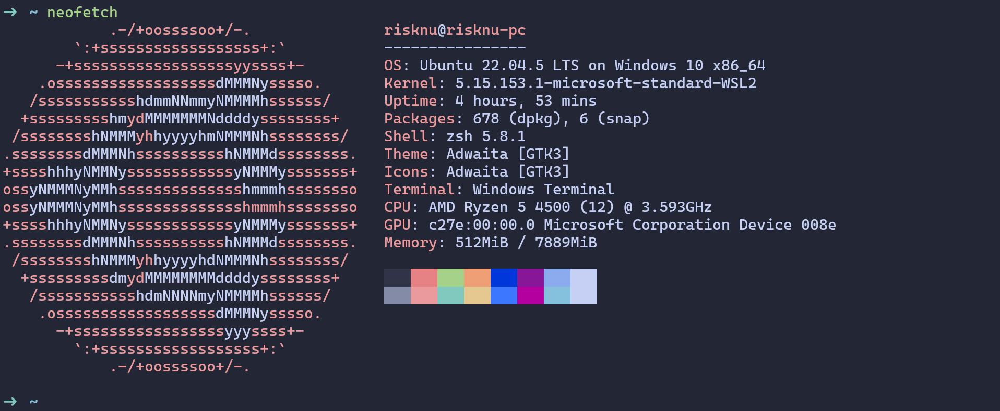

## Simple Installation
Just download the repository and run `install.sh`:
```bash
git clone https://github.com/risknu/configuration
```
```bash
cd configuration && source install.sh
```
> You will need to manually type `:PlugInstall` in Vim.

## My Configurations for Various Things
First of all, these are very simple and aesthetically pleasing configurations that just look nice. Feel free to add or take anything you like. I'll show and explain what everything does.

> I'm using Debian/Ubuntu, so everything works 100% on these systems.



### Terminal Color Scheme
I'm using the [Catppuccin](https://github.com/catppuccin/catppuccin) color scheme, which is simple and looks pretty nice. If you need the `json` version to import it into the settings of Windows Terminal, here it is:
```json
{
    "background": "#181926",
    "black": "#181926",
    "blue": "#8AADF4",
    "brightBlack": "#181926",
    "brightBlue": "#8AADF4",
    "brightCyan": "#91D7E3",
    "brightGreen": "#A6DA95",
    "brightPurple": "#C6A0F6",
    "brightRed": "#ED8796",
    "brightWhite": "#CAD3F5",
    "brightYellow": "#EED49F",
    "cursorColor": "#CAD3F5",
    "cyan": "#91D7E3",
    "foreground": "#CAD3F5",
    "green": "#A6DA95",
    "name": "Color Scheme 12",
    "purple": "#C6A0F6",
    "red": "#ED8796",
    "selectionBackground": "#CAD3F5",
    "white": "#CAD3F5",
    "yellow": "#EED49F"
}
```

### Basic System Setup
If you're using Debian/Ubuntu, you need to install the following:
```bash
sudo apt install build-essential cmake python3-dev
```

### Installing Zsh and Oh My Zsh Instead of Bash
We'll install Zsh, which is the best shell in my opinion, and [Oh My Zsh](https://github.com/ohmyzsh/ohmyzsh/) to add some cool features.

**Install the Zsh shell:**
```bash
sudo apt install zsh
```

**Install Oh My Zsh:**
```bash
sh -c "$(curl -fsSL https://raw.githubusercontent.com/ohmyzsh/ohmyzsh/master/tools/install.sh)"
```

Next, we'll configure Zsh. Open the file `~/.zshrc` in nano or vim and add the following:
```bash
export ZSH=$HOME/.oh-my-zsh
ZSH_THEME="robbyrussell"
plugins=(git zsh-syntax-highlighting bundler)
source $ZSH/oh-my-zsh.sh
```

Afterward, install syntax highlighting. Be sure to restart the terminal or refresh the shell after installation:
```bash
git clone https://github.com/zsh-users/zsh-syntax-highlighting.git ${ZSH_CUSTOM:-~/.oh-my-zsh/custom}/plugins/zsh-syntax-highlighting
```

### Installing VIM
Now we'll install an enhanced version of Vim, which is great for programming in C/C++/Python because it has full support for these languages. Make sure to have the latest version of Vim installed.

**Install Vim:**
```bash
sudo apt install vim
```

**Install Plugins:**
```bash
curl -fLo ~/.vim/autoload/plug.vim --create-dirs \
https://raw.githubusercontent.com/junegunn/vim-plug/master/plug.vim
```

Next, we need to configure Vim. Open `~/.vimrc` and add the following:
```vim
call plug#begin('~/.vim/plugged')

" ALE settings
let g:ale_linters = {
\   'python': ['flake8', 'pylint'],
\   'c': ['gcc'],
\   'cpp': ['g++'],
\   'sh': ['shellcheck'],
\}
let g:ale_fixers = {
\   'python': ['autopep8'],
\   'c': ['clang-format'],
\   'cpp': ['clang-format'],
\   'sh': ['shfmt'],
\}
let g:ale_fix_on_save = 1

" Jedi settings
let g:jedi#completions_enabled = 1
let g:jedi#auto_vim_configuration = 0

" General settings
syntax on
set background=dark

set number
set tabstop=4
set shiftwidth=4
set expandtab
set showmatch
set wildmenu
set clipboard=unnamedplus

" Plugins
Plug 'dense-analysis/ale'
Plug 'davidhalter/jedi-vim'
Plug 'tmhedberg/SimpylFold'

Plug 'vim-syntastic/syntastic'
Plug 'ycm-core/YouCompleteMe'

Plug 'preservim/nerdtree'
Plug 'scrooloose/nerdcommenter'
Plug 'jiangmiao/auto-pairs'

" Shell scripting support
Plug 'vim-scripts/bash-support.vim'   " Enhanced Bash scripting support
Plug 'vim-syntastic/syntastic'        " Syntastic syntax checking for various languages, including shell
Plug 'tmhedberg/SimpylFold'           " Automatic code folding for shell scripts

call plug#end()
```

After installing, **make sure** to open Vim and run the following command:
```vim
:PlugInstall
```

---

## Potential Issues You May Encounter
**YouCompleteMe unavailable: requires Vim 9.1.0016+** - If you get this error, simply update Vim. If it doesn't update through your package manager, download the latest version from GitHub and compile it manually.
